# RecoPAY - 추천 결제 시스템
## 프로젝트 계획 이유
일단은 무언가를 만들어보자는 의지가 강한 저희 팀은 여러 API를 확인한 결과 많은 정보를 제공하는 공연예술통합전산망(KOPIS)에서 제공하는 OPEN API를 사용하기로 결정하였습니다. 본 취지는 API를 사용해서 DB를 구축하고 DB에 있는 데이터를 화면에 띄우는 것과 CRUD 싸이클의 기본인 게시판을 구축하는 것이었습니다. 더 방대한 시스템을 만들고 싶은 욕구가 있었기에 결제와 추천까지 해주는 시스템을 만들자 라는 계획이 추가되었지만, 결제까지 이르지 못하고 예약을 하고 확인할 수 있는 시스템을 만들게 되었습니다.

정리하면, 연극 정보를 확인하고 해당 연극장 좌석에 예약을 하고 마이페이지에서 확인할 수 있습니다. 그리고 본 작품에 대해서는 평가가 가능하고 좋게 평가한 작품에 대해서는 비슷한 작품을 추천받을 수 있는 구조입니다.

## 프로젝트 기능 설명

### [연극소개] 

 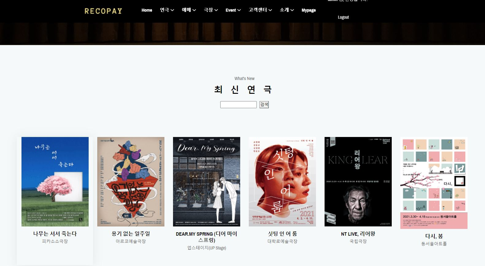</img> 

- 연극 검색 기능
- 최신 연극과 극장 확인 

 

 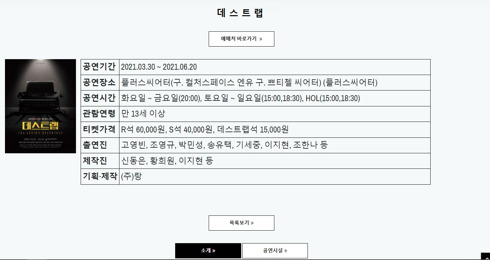</img> 

- 관심있는 연극의 디테일 페이지
- 정보 확인 후 바로 예매처로 이동하는 기능
- 소개 이미지와 공연시설에 대한 정보 확인 가능
- 공연시설의 위치 구글맵으로 확인가능 -> Google Map API

 

### [후기게시판] 

 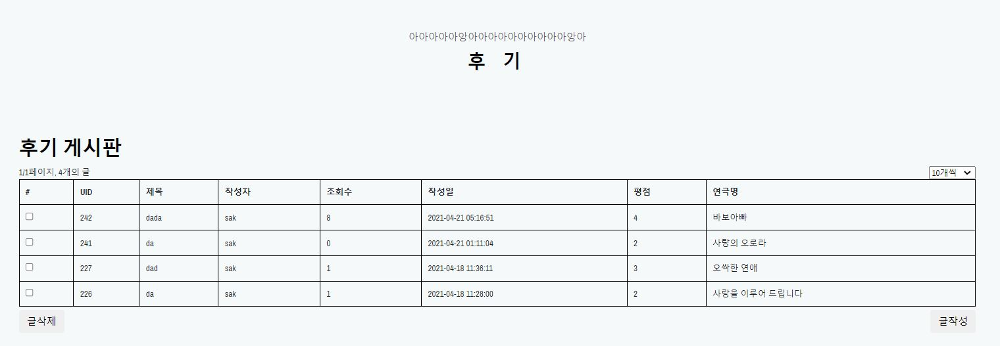</img> 

- AJAX를 사용한 동적 게시판
- CRUD 사이클 구현

 

 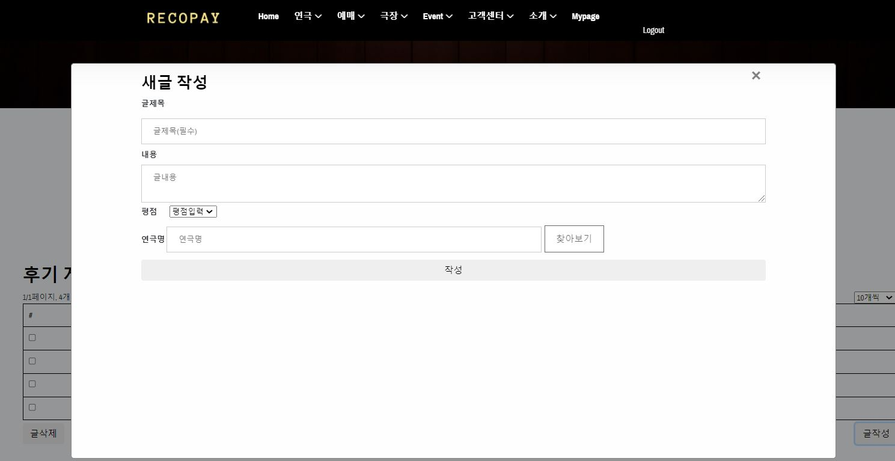</img> 

- 모달 창 구현

 

 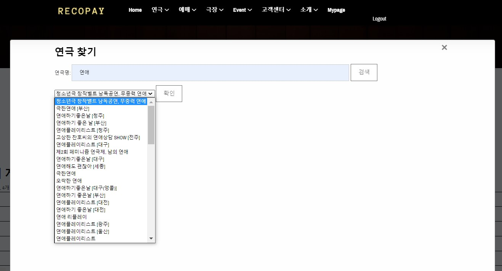</img> 

- 더블 모달 창 구현 (연극명 찾기)

 

 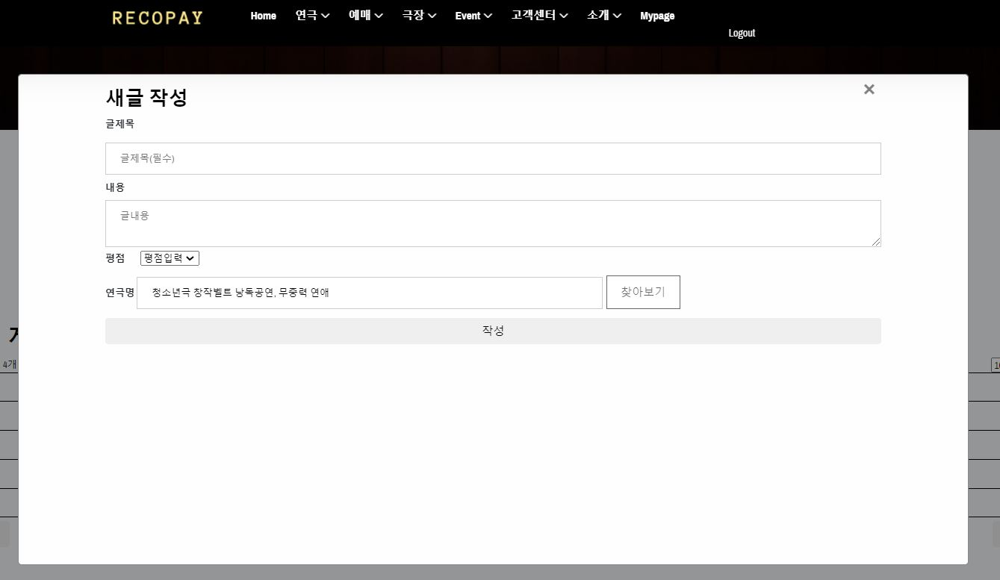</img> 

- 확인 누르면 새글 작성 연극명 파트에 자동 입력 기능

 

### [연극추천] 

 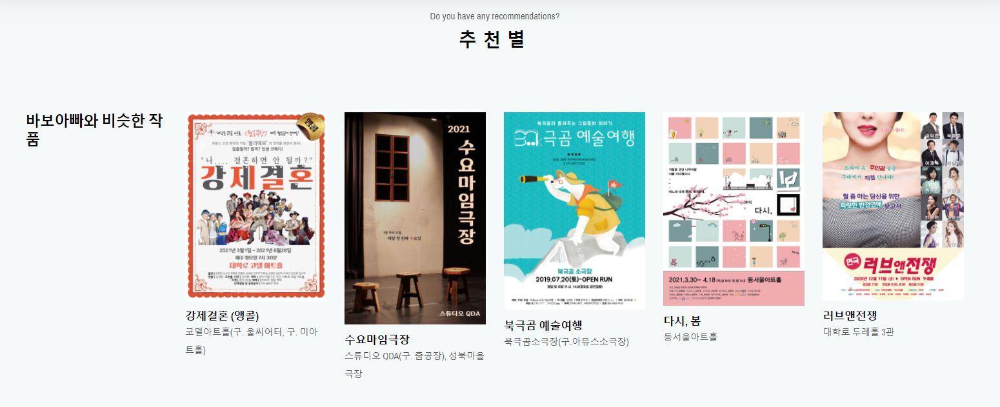</img> 

- 평점 4점 이상 기준으로 각 작품의 비슷한 작품 5개 추천
- Python과 Jupyter NoteBook, Oracle DB를 사용하여 진행
#### [진행방식]
1. API를 확인해본 결과 줄거리가 없는 작품을 확인
2. 기존에 존재하는 것은 DB에 그대로 저장
3. 존재하지 않는 것은 공연소개 이미지안에 줄거리를 추출 -> Google Vision API OCR 사용
4. 추출한 줄거리 DB에 저장
5. 줄거리 데이터 약 7000개 정도 구축 
6. DB에서 모든 줄거리 데이터 끌고와 형태소 분석 -> Mecab 라이브러리
7. 명사와 동사만 추출
   1. 동사는 원형으로 변형
8. 명사와 동사로만 이루어진 새로운 텍스트들을 Gensim 라이브러리 중 Doc2Vec을 사용하여 학습
9. 각 줄거리는 고유한 벡터의 값을 가지고 비슷한 줄거리는 유사한 벡터 값을 가짐
10. 각 작품의 비슷한 작품을 선정하기 위해 코사인 유사도를 사용
11. 각 작품마다 유사도 값이 높게 나오는 작품 5개씩 추천 테이블에 저장
12. 자바(Spring, eclipse)에서 DB에 접근하여 4점 이상인 작품의 ID 값을 가지고 추천 테이블 접근하여 사용자 화면에 5가지 작품 띄어주기!

### [극장소개] 

 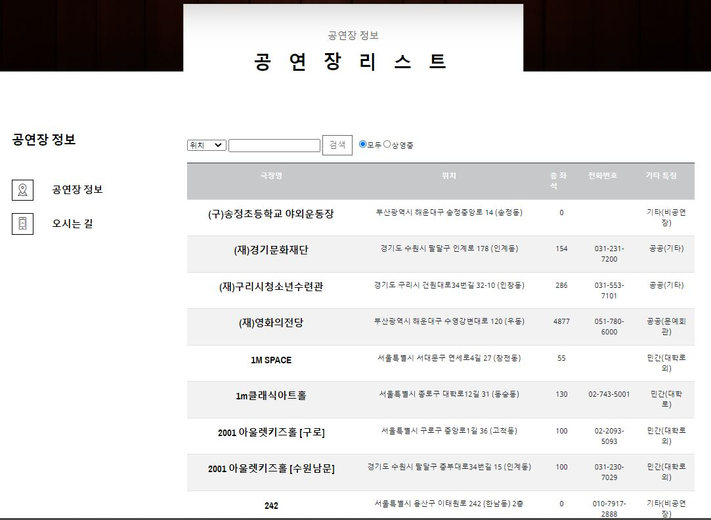</img> 

- 극장 검색 기능
- 극장 기본 정보 확인 가능

 

 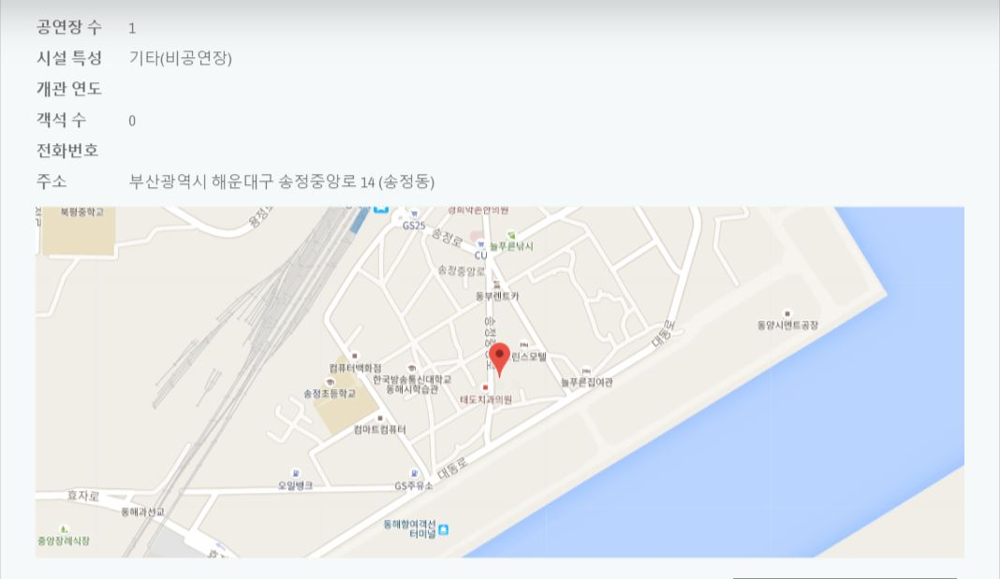</img> 

- 극장 상세 정보 확인
- 해당 극장 위치 구글맵으로 확인 가능

 

### [예매하기] 

 </img> 

- 예매하기 버튼을 눌러 예매 가능
- 연극의 대한 정보는 연극소개 버튼으로 확인 

 

 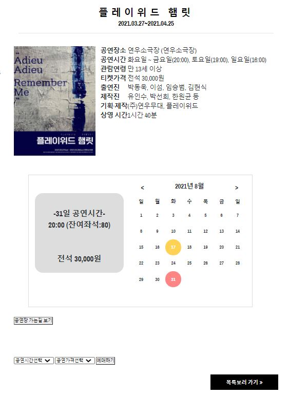</img> 

- 원하는 날짜 선택 후 잔여좌석 확인
- 공연시간과 좌석가격선택 후 예매하기
  

 

 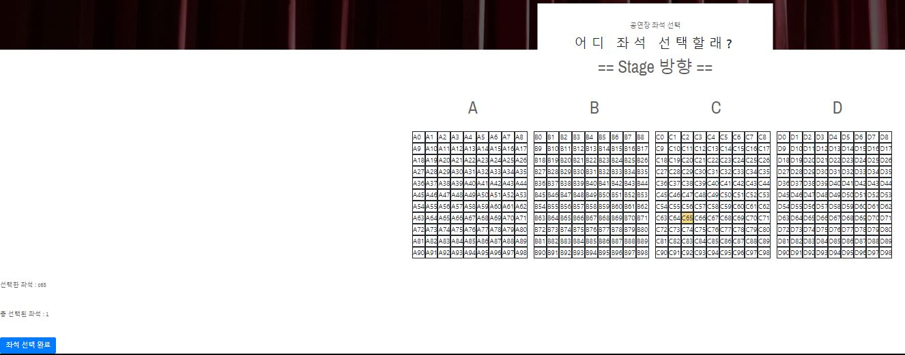</img> 

- 원하는 위치 선택 후 좌석 선택 완료 하기
- 복수의 위치 선택 가능 

 

 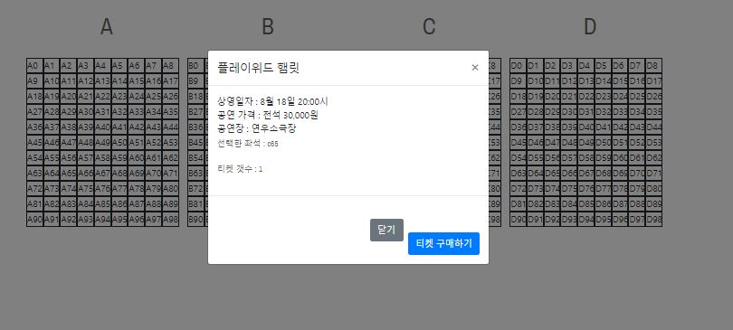</img> 

- 확인 후 티켓 구매

 

 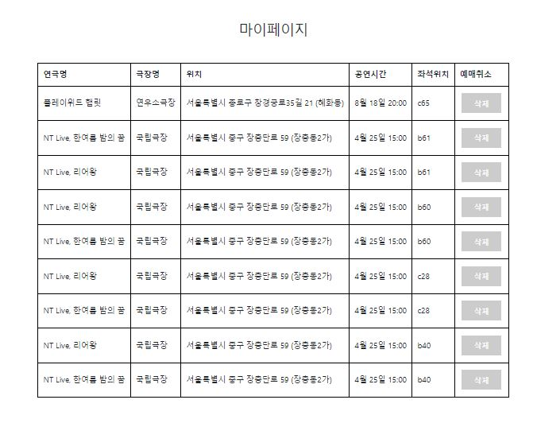</img> 

- 마이페이지에서 확인 및 삭제 가능

 

### [로그인]

 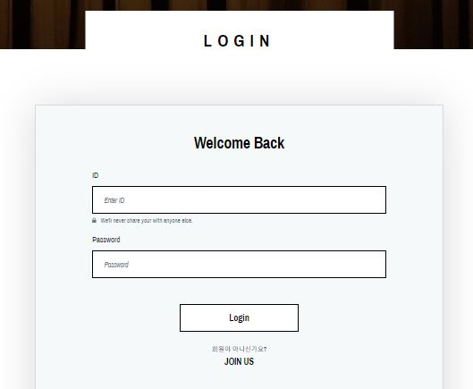</img> 

- Spring Security 적용
- 회원이 아니면 MaPage 접근, 게시판 작성, 예매 등 불가하며 로그인 페이지로 자동 이동
- 비회원은 연극정보와 극장정보는 확인 가능
- 기존 가입은 멤버의 권한을 가지고, 관리자는 DB에서 admin으로 수정

 

### [회원가입]

 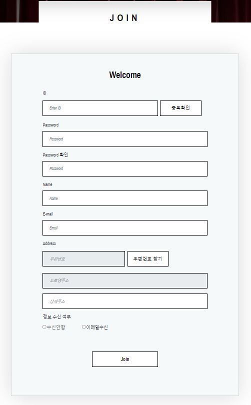</img> 

- 회원가입은 기본 정보만 입력받도록 구성

## 사용 기술
...

## 개발 환경
...

## 후기
전체적으로 모든 파트에 관여했으며, 집중하여 전담한 파트는 연극소개, 연극추천, 후기게시판이다. 초중반에 내게 주어진 파트에 집중하여 구현을 마치고, 다른 팀원들을 도와주며 다른 파트에 대한 지식을 쌓아 모든 파트를 구현할 수 있는 자신감이 생겼다. 

## 참고
...